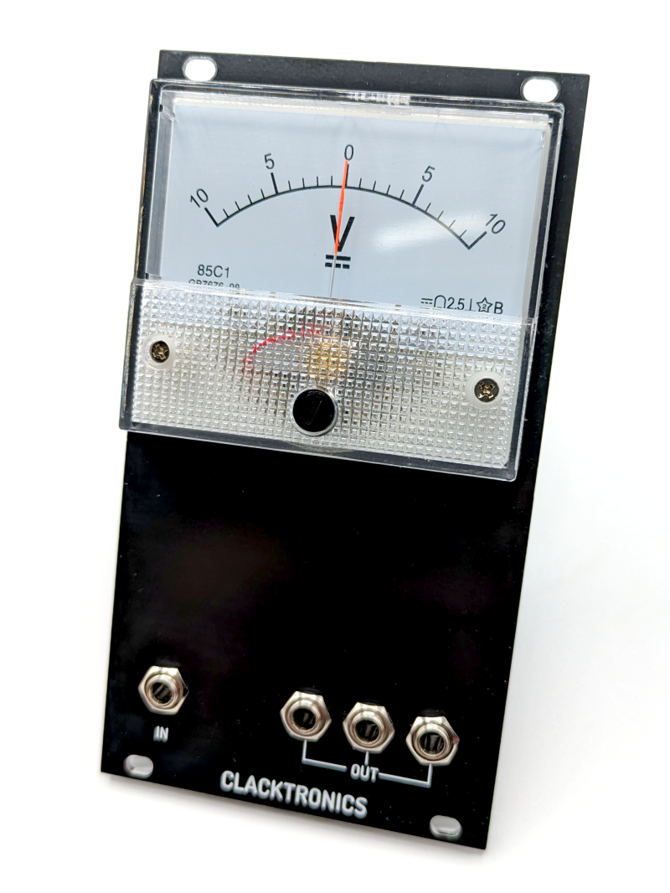

# Clacktronics Analogue Voltmeter

Want your modular to look cool and vintage? Ever wanted to see what your slow evolving CV signal is doing or where it actually is?! Analogue meter is for you! Clacktronics Analogue meter is a partially assembled kit that contains the driving circuitry and the meter to add a Voltage needle meter into your rack. The meter itself is bipolar and able to measure +10V to -10V and the driving circuitry as a bonus offers 3 buffer mult outputs

* Width: 14HP
* Height: 3U
* Depth: 50mm

More information at [clacktronics.co.uk/euroclack](http://clacktronics.co.uk/euroclack)
